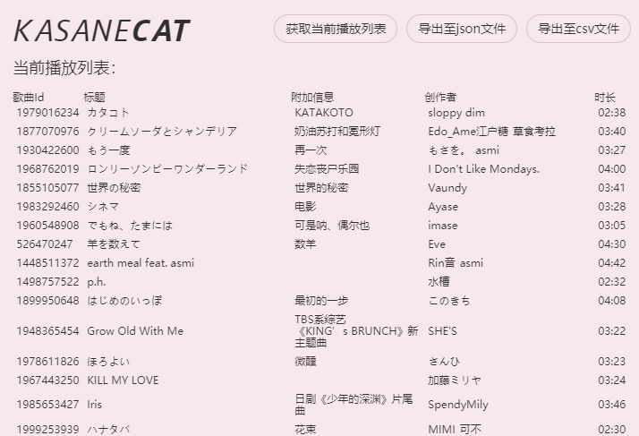

# 𝘒𝘈𝘚𝘈𝘕𝘌𝘾𝘼𝙏

A BetterNCM plugin which helps users export their current playlist.

## > About
After being properly installed, 𝘒𝘈𝘚𝘈𝘕𝘌𝘾𝘼𝙏 can be found in BetterNCM's plugin list, then you can select it to open export UI.

## > Packing & Running
If you're using Windows and have Bandizip installed on your computer, run <code>pack.bat</code> in the folder and it'll pack the plugin and move it into the plugins folder.

## > Screenshots
